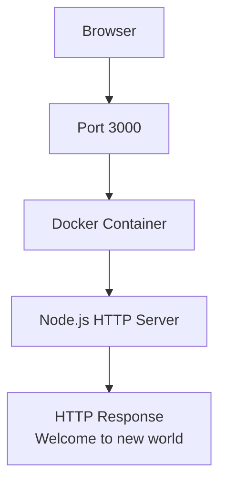
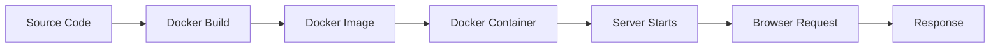

# Dockside

## Hero Section


> Dockside is a minimal Dockerized Node.js HTTP server that returns a friendly welcome message. The application is intentionally small, but the repository is structured to demonstrate clean Docker usage, clear operational flow, and production-style documentation.

---

## Overview

Dockside is a compact containerized Node.js project built to show how a simple service can be packaged, shipped, and run consistently across environments. It uses Node's built-in HTTP module and a lightweight Alpine-based Docker image to keep the runtime small and easy to understand.

This project was built to demonstrate the essentials of container-first application delivery without unnecessary complexity. It solves a common early-stage problem: how to take a tiny Node.js service and run it in an isolated, reproducible environment that behaves the same on every machine.

It is intended for developers who want to:

| Audience | Why it helps |
| --- | --- |
| Beginners | Learn how a Node.js app moves from source code to container |
| Recruiters and reviewers | Quickly understand a clean, professional Docker setup |
| Engineers | Use a minimal project as a baseline for experimentation or expansion |

Docker is especially useful here because it removes environment drift, standardizes startup behavior, and makes it easy to share a working runtime with one command. Even for a tiny project like Dockside, that discipline is valuable because it mirrors how real services are packaged in production.


## Table of Contents

- [1. Hero Section](#hero-section)
- [2. Overview](#overview)
- [3. Table of Contents](#table-of-contents)
- [4. Features](#features)
- [5. System Architecture](#system-architecture)
- [6. Application Workflow](#application-workflow)
- [7. Technology Stack](#technology-stack)
- [8. Project Structure](#project-structure)
- [9. Getting Started](#getting-started)
- [10. Running Locally](#running-locally)
- [11. Running with Docker](#running-with-docker)
- [12. API Documentation](#api-documentation)
- [13. Dockerfile Breakdown](#dockerfile-breakdown)
- [14. What You'll Learn](#what-youll-learn)
- [15. Future Enhancements](#future-enhancements)
- [16. Conclusion](#conclusion)
- [17. License](#license)

---

## Features

Dockside keeps the implementation intentionally small while still showcasing solid engineering habits.

| Feature | Description |
| --- | --- |
| Lightweight Node.js HTTP server | Uses the built-in `node:http` module instead of additional frameworks |
| Dockerized deployment | Runs identically inside a containerized environment |
| Alpine Linux base image | Keeps the image lean and practical for a simple service |
| Fast startup | Minimal dependencies and a single-process runtime make startup immediate |
| Minimal architecture | Easy to read, easy to reason about, and easy to extend |
| Beginner-friendly | Good starting point for learning Docker and Node.js together |
| Production-style Dockerfile | Uses a clear build flow with layered image construction |

---

## System Architecture



### Component Breakdown

| Component | Role |
| --- | --- |
| Browser | Sends the request to the exposed application port |
| Port 3000 | Public entry point mapped from the host to the container |
| Docker Container | Isolates the runtime and packages the application consistently |
| Node.js HTTP Server | Handles the incoming request and returns the response |
| HTTP Response | The plain-text message returned to the client |

---

## Application Workflow



### Workflow Summary

1. Source code lives in the repository and defines the server behavior.
2. Docker builds an image from the `Dockerfile` and the application files.
3. The image is turned into a container at runtime.
4. The server starts inside the container and listens on port `3000`.
5. A browser request reaches the container through port mapping.
6. The server responds with the welcome message.

---

## Technology Stack

| Technology | Purpose |
| --- | --- |
| Node.js | JavaScript runtime used to run the server |
| Docker | Container platform used to package and run the app |
| Native HTTP module | Built-in Node.js module used to create the server |
| JavaScript | Primary language used for the application logic |

---

## Project Structure

```text
Dockside/
├── app.js
├── Dockerfile
├── package-lock.json
├── package.json
├── README.md
└── .gitignore
```

| File | Purpose |
| --- | --- |
| `app.js` | Defines `createServer()` and starts the HTTP server on port `3000` when run directly |
| `Dockerfile` | Builds a lightweight Node.js container image using Alpine Linux |
| `package.json` | Stores project metadata and the npm start script |
| `package-lock.json` | Locks dependency resolution for reproducible installs |
| `README.md` | Documents the project, usage, and engineering context |
| `.gitignore` | Prevents local dependencies and OS noise from being committed |

---

## Getting Started

### Prerequisites

| Requirement | Recommended Version | Notes |
| --- | --- | --- |
| Node.js | 20 or later | Needed for local execution and npm scripts |
| Docker | Latest stable version | Needed to build and run the container image |

### Installation

Clone the repository and install dependencies:

```bash
npm install
```

This installs the project dependencies listed in `package.json` and prepares the app for local execution or container builds.

> Note: The repository already includes a `package-lock.json`, which helps keep installs reproducible across machines.

---

## Running Locally

Start the server with npm:

```bash
npm start
```

### What this command does

| Step | Meaning |
| --- | --- |
| `npm start` | Runs the `start` script defined in `package.json` |
| `node app.js` | Launches the HTTP server |
| `PORT` resolution | Uses `process.env.PORT` if set, otherwise defaults to `3000` |

### Expected output

When the app starts successfully, the terminal should show something like:

```text
Server running at http://localhost:3000
```

### Verify in the browser

Open:

```text
http://localhost:3000
```

Expected response:

```text
Welcome to new world
```

---

## Running with Docker

Build the container image:

```bash
docker build -t dockside .
```

Run the container and map port `3000` from the container to your machine:

```bash
docker run -p 3000:3000 dockside
```

### Docker Commands

| Command | Purpose |
| --- | --- |
| `docker build -t dockside .` | Builds a local image named `dockside` from the current directory |
| `docker run -p 3000:3000 dockside` | Starts a container and exposes the app on `http://localhost:3000` |

### Container lifecycle notes

| Stage | Description |
| --- | --- |
| Build | Docker reads the `Dockerfile` and creates an immutable image |
| Run | Docker launches a container from that image |
| Port mapping | The host port is forwarded to the container's internal port |
| Shutdown | Stopping the container stops the app process as well |

### Next Steps

To grow this project, the next natural upgrades would be:

- Add routing with Express
- Serve an HTML landing page instead of plain text
- Add health checks for Docker
- Add tests and a CI workflow
- Add environment-based configuration

---

## API Documentation

Dockside currently exposes a single endpoint.

| Method | Path | Response |
| --- | --- | --- |
| `GET` | `/` | Returns a plain-text welcome message |

### Response

```http
HTTP/1.1 200 OK
Content-Type: text/plain; charset=utf-8

Welcome to new world
```

There are no additional routes in the current application, so this documentation intentionally stays minimal and accurate.

---

## Dockerfile Breakdown

| Instruction | Why it exists |
| --- | --- |
| `FROM node:20-alpine` | Uses a small Node.js base image so the final container stays lightweight |
| `WORKDIR /app` | Sets a predictable working directory inside the container |
| `COPY package*.json ./` | Copies dependency manifests first so Docker can cache dependency installation efficiently |
| `RUN npm ci` | Installs exact dependencies from the lockfile for reproducible builds |
| `COPY . .` | Copies the application source into the image |
| `EXPOSE 3000` | Documents the port the app listens on inside the container |
| `CMD ["npm", "start"]` | Starts the server when the container launches |

### Why this structure works well

The Dockerfile follows a clear build order that supports caching, reproducibility, and readability. That makes it a strong pattern for small production-style services and a good foundation for more advanced container builds later.

---

## What You'll Learn

Dockside is small, but it teaches several core concepts that matter in real-world software delivery.

| Concept | What you learn |
| --- | --- |
| Containerization | How to package an app with its runtime environment |
| Docker Images | How images are built as immutable artifacts |
| Docker Containers | How images run as isolated processes |
| Port Mapping | How host traffic reaches a containerized service |
| Node.js Runtime | How Node executes a server-side JavaScript app |
| Image Layering | Why Dockerfile order matters for caching and rebuild speed |
| Docker CLI | How to build and run container images from the terminal |
| Container Networking Basics | How browser requests reach services running inside containers |

---

## Future Enhancements

Dockside is intentionally minimal, but it can be expanded into a more complete service over time.

| Idea | Value |
| --- | --- |
| Express.js | Add routing, middleware, and more flexible HTTP handling |
| Health Checks | Improve container observability and orchestration readiness |
| Docker Compose | Support multi-service development workflows |
| GitHub Actions | Automate linting, builds, and future tests |
| CI/CD | Move from manual shipping to repeatable delivery pipelines |
| NGINX Reverse Proxy | Add a production front door for traffic management |
| Environment Variables | Make configuration more flexible across environments |
| Logging | Improve visibility into runtime behavior |
| HTTPS | Secure traffic for real deployments |
| Cloud Deployment | Run the app on a cloud platform or container service |
| Monitoring | Track availability, performance, and runtime health |

> Note: None of these enhancements are implemented yet. They are natural next steps if the project grows beyond its current teaching-focused scope.

---

## Conclusion

Dockside demonstrates how a tiny Node.js service can be packaged cleanly, run consistently in Docker, and documented with the same care you would expect from a larger production repository. Its value is not in complexity, but in the clarity of the implementation and the discipline of the container workflow.

That makes it a strong foundation for larger containerized applications, especially when you want a simple baseline for experiments, teaching, interviews, or future expansion.

---

## License

This repository does not currently include a license file.

| Option | Status |
| --- | --- |
| Current state | No license file present |

---

## Name

The name Dockside fits the project well because it is short, memorable, and directly connected to the container-first workflow the repository demonstrates.
